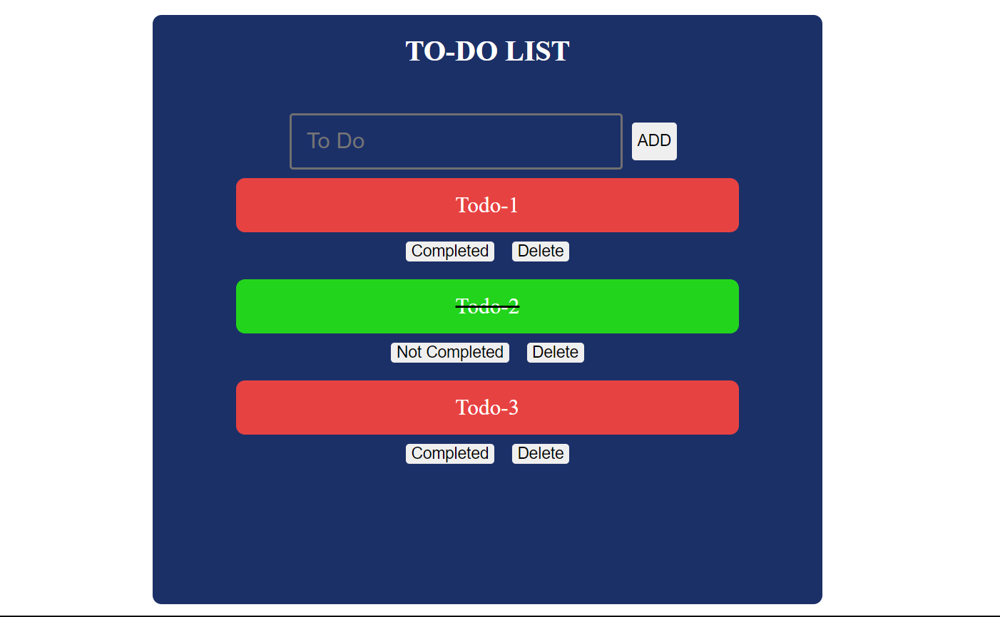

## Getting Started

[LIVE HERE](https://todo-app-hooks-pi.vercel.app/) 


```bash
Todo App
git clone https://github.com/metekog/Todo-App-Hooks.git
cd todoapp_youtube/
npm i
npm start
# or
yarn run
```

# ScreenShot

## Home Screen


